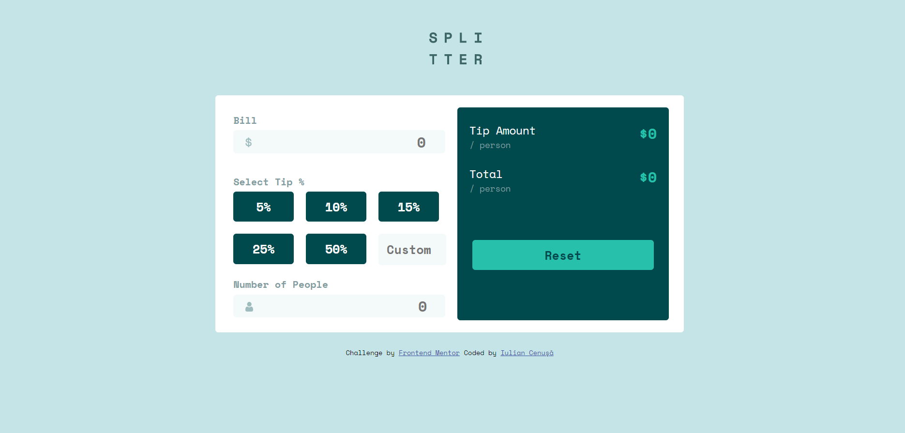

# Frontend Mentor - Tip calculator app solution

This is a solution to the [Tip calculator app challenge on Frontend Mentor](https://www.frontendmentor.io/challenges/tip-calculator-app-ugJNGbJUX). Frontend Mentor challenges help you improve your coding skills by building realistic projects.

## Table of contents

- [Overview](#overview)
  - [The challenge](#the-challenge)
  - [Screenshot](#screenshot)
  - [Links](#links)
- [My process](#my-process)
  - [Built with](#built-with)
  - [What I learned](#what-i-learned)
  - [Continued development](#continued-development)
  - [Useful resources](#useful-resources)
- [Author](#author)

## Overview

### The challenge

Users should be able to:

- View the optimal layout for the app depending on their device's screen size
- See hover states for all interactive elements on the page
- Calculate the correct tip and total cost of the bill per person

### Screenshot



### Links

- Solution URL: [GitHub Repository](https://github.com/iulian-cenusa/frontend-mentor-tip-calculator-app)
- Live Site URL: [GitHub Pages](https://iulian-cenusa.github.io/frontend-mentor-tip-calculator-app/)

## My process

### Built with

- Semantic HTML5 markup
- CSS custom properties
- Flexbox
- CSS Grid
- Mobile-first workflow

### What I learned

In this project I learned how to use CSS Grid and Flexbox better.

Please see bellow a few snippets:

```css
.main{
  display: flex;
  justify-content: space-evenly;
  margin: 25px;
  background-color: hsl(0, 0%, 100%);
  border-radius: 5px;
}
```
```js
function calculate(){
    if ( nrPeople == 0 ){
        total.innerHTML = '$0'
        tip.innerHTML = '$0'
    }
    else{
        let billPerPeople = ( billAmount/nrPeople ).toFixed(2)
        let totalAmount = parseFloat(billPerPeople) + parseFloat(tipAmount)
        total.innerHTML = '$' + totalAmount.toFixed(2)
        tip.innerHTML = '$' + tipAmount
    }
}
```

### Continued development

This project is not 100% complete as there are a few bugs left in the code that I hope to fix.

### Useful resources

- [Freecodecamp](https://www.freecodecamp.org/) - This helped me to understand better CSS Grid and Flexbox by doing exercises on Responsive Web Design Certification.
- [Web Dev Simplified YouTube Channel](https://www.youtube.com/channel/UCFbNIlppjAuEX4znoulh0Cw) - This is an amazing youtuber that have a lot of useful videos on a lot of programming topics.

## Author

- Frontend Mentor - [@iulian-cenusa](https://www.frontendmentor.io/profile/iulian-cenusa)
- Twitter - [@IulianCenusa](https://twitter.com/IulianCenusa)
- Other Projects - [Bitbucket Repo](https://bitbucket.org/iulian_cenusa/)


